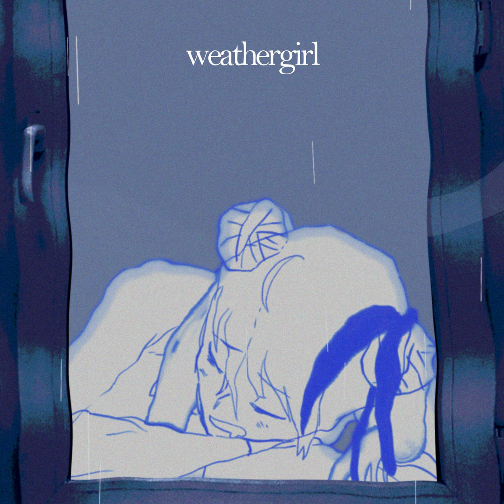

  
<h2>I'm DotLYHiyou, an aspiring ML/AI engineer.</h3>

  

I like doing programming as a cozy, laid-back hobby as well as a future career.

  <table>
    <tr>
      <td align="center" width="200">
        
      </td>
      <td valign="middle">
        <h2>Weather Girl</h2>
        
<b>by Flavor Foley</b>

        
      </td>
    </tr>
  </table>

